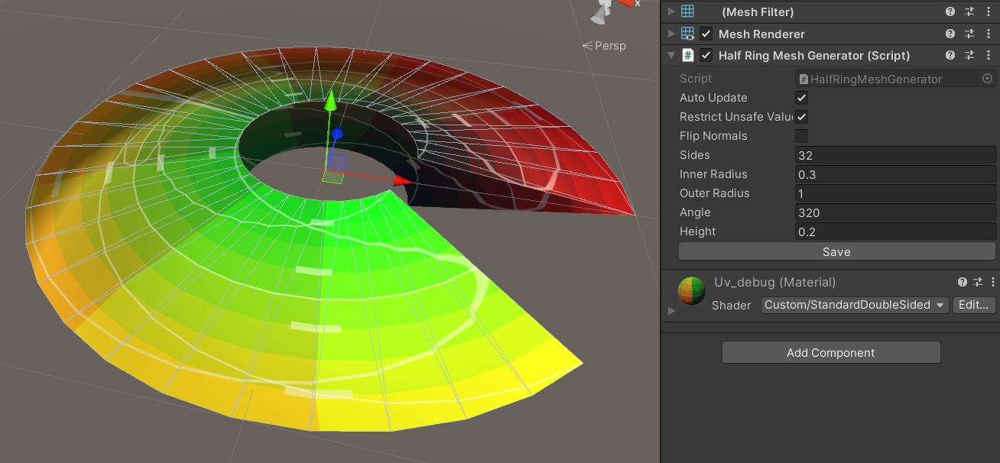

<h1 align="center">VFX Mesh Generator</h1>
Useful 3D mesh generator for Visual Effect. It has controllable properties that fits with the usual usecase for making VFX.

## ✨ Features
- Generate primitive uv mapped 3d mesh with controllable properties
- Edit the mesh dynamically on runtime
- Auto update mesh on editor
- Flip normals
- Save mesh

## 💻 Generators
- Hollow Circle
- 2 Dimensional Cone
- Half Ring
- Ring
- Free controllable Cone

## 📋 Images

| Class                      | Screenshot               |
| -------------------------  | ------------------------ |
| HollowCircleMeshGenerator. |        |
| Cone2DMeshGenerator.       |        |
| HalfRingMeshGenerator.     |        |
| RingMeshGenerator.         |        |
| FreeConeMeshGenerator.     |        |

## 🔍 API Reference

### MeshGenerator

Get the reference by
```csharp
MeshGenerator generator = GetComponent<MeshGenerator>();
```
#### 🔗 Syntax
| Method                            | Description                        |
|:--------                          | :------------------------------    |
|`Draw()`                           | Redraw the current mesh to current properties |
|`SaveMesh()`                       | Save the current mesh as file |

| Properties          | Type                | Description                        |
|:--------            | :--------           | :------------------------------    |
|`FlipNormals`        | bool                | Choose wether to flip the normals or not |

#### 📖 Examples

Set the outer radius of the generated 2D Cone to 20 and the angle to 120 degree. Flip the normal. Then redraw the result.
```csharp
Cone2DMeshGenerator generator = GetComponent<Cone2DMeshGenerator>();
generator.OuterRadius = 20;
generator.Angle = 120;
generator.FlipNormals = true;
generator.Draw();
```


### FreeConeMeshGenerator

Get the reference by
```csharp
FreeConeMeshGenerator generator = GetComponent<FreeConeMeshGenerator>();
```
#### 🔗 Syntax
| Method                            | Description                        |
|:--------                          | :------------------------------    |
|`EditVerticesByEquation(float x)`  | Edit the vertices by math equation with y = f(x). It change the elements of HeightList |

| Properties         | Type             | Description                        |
|:--------           | :--------        | :------------------------------    |
|`StartHeight`       | float            | The left border of the x of the function |
|`EndHeight`         | float            | The right border of the x of the function |
|`Sides`             | float            | Amount of sides. Also used as resolution of the mesh |
|`Angles`            | float            | Angle of the mesh |
|`HeightList`        | List<HeightData> | List of height and radius of the vertices. Can be edited manually or edited by EditVerticesByEquation(float x) |

#### 📖 Examples

Change the vertices into y = sqrt(x) with x from 0 to 10 which is parabole (inverse of y = x^2).
```csharp
RoundedConeMeshGenerator generator = GetComponent<RoundedConeMeshGenerator>();
generator.StartHeight = 0;
generator.StartHeight = 10;
generator.EditVerticesByEquation(x => Mathf.Pow(x, 0.5f));
generator.Draw();
```

## 📝 License
[MIT](https://choosealicense.com/licenses/mit/)

## 📑 Reference
Judkins, Chris. (2019, January 19). Debug Textures for VFX. Retrieved December 29, 2023, from https://realtimevfx.com/t/debug-textures-for-vfx/7510